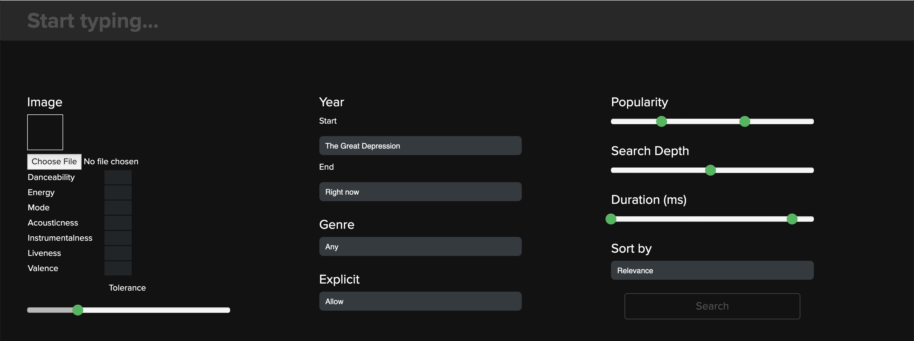
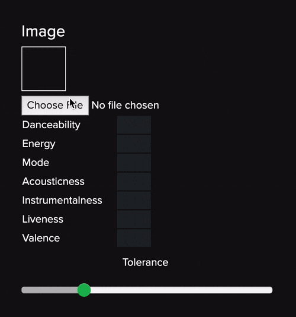
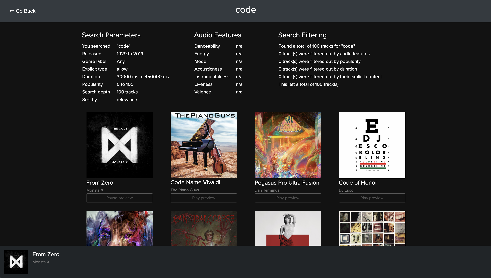
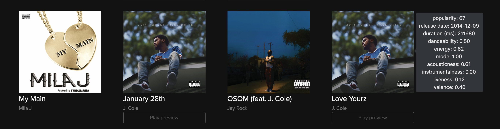

#  findio
The Spotify search you don't need and never wanted.

See the live site: [http://www.findio.ml](http://www.findio.ml)

## Table of contents

- [Overview](#overview)
    - [Search interface](#search-interface)
    - [Search results](#search-interface)
- [Setup](#setup)
    - [Training](#training)
- [Award](#award)
- [License](#license)


## Overview

**findio** is a web app built on Node.js and Python with TypeScript, Express, HTML/CSS/JS, Bootstrap, and TensorFlow (+TensorFlow.js).

It provides an overly complicated, yet very powerful search interface for the Spotify catalog via the Spotify Web API. Use it to find new songs in a different way or analyze your favorite songs to understand how they are related.

### Search interface



**findio** provides an overengineered search interface for the Spotify catalog with the ability to search across a number of different attributes, filters, and sorting methods, many of which are not currently made available as part of the Spotify API.

- Audio feature similarity (by image or manual)
- Release year range
- Genre
- Explicit content
- Popularity
- Search depth
- Track duration
- 29 different sorting options

The following sections will walk through how to use these features.

#### Image to audio feature neural network

We trained a [convolutional neural network ](https://en.wikipedia.org/wiki/Convolutional_neural_network) using a dataset of album covers and the associated Spotify audio features for each track in order to learn a mapping from the pixel space to the audio feature space. This means that you can upload any image from your computer and the model will predict the audio features for a track that had that image as its album cover. You can then specify a tolerance value which is used to filter out search results that are far away from the given audio features. Optionally, you can directly specify the the audio features without uploading an image. 



The CNN was trained in Python using Keras. 
After training we save out the model architecture and weights and use TensorFlow.js running on the front-end to load the trained model. 
When you upload an image it is processed on the front-end to be 64x64 (crudely) and then run through the model. 
Therefore, note that we do not access or save any files you upload, 
they all remain completely on the client (we also use your CPU to run the model saving our server valuable flops). 

#### Release range

You can select a range of years to search across. 
Only tracks released within that range will be shown. 
To make your music search extra nostalgic, all of the years are listed by an event that occurred that year. 
Make sure to select a start year earlier than the end year, or else you will not get any results. 
To make things easy, it defaults to searching all songs released between the Great Depression and Right now. 

#### Genre

Spotify provides a list of hundreds of genres that can be used during a search. 
We allow you to specify one of these genres during the search, or specify 'Any'. 
Note that many of these genres seem to be somewhat bogus, and not all will return search results. 

#### Explicit

A simple control to specify what you want to do with explicit content. 
You can allow explicit content (default), exclude it, or only allow explicit content.

#### Popularity

Popularity is one of the key features of a track. 
This slider allows you to specify a range of acceptable popularity values. 
This will allow you to find only the most popular tracks if you can't be bothered with any of that underground indie junk,
 or filter out what the masses are listening to.

#### Search depth

If you want more results, go deeper. 
This control allows you to specify how deep into the annals of Spotify to search for that golden track. 
You can search up to 1000 tracks deep. Note that this will increase the search time, so please be patient. 
If you are having issues finding any tracks for your search, increase the search depth to see if that helps. 

#### Duration

Straightforward control over the length of tracks in the search results.
 This lets you remove tracks that are very lengthy or very short. 

#### Sort

Once all of the search results have been filtered you have a number of options of how you would like to sort them.

- Relevance - Spotify based relevance sort
- Irrelevance - Most irrelevant results first
- Random - Randomly shuffle all of the results
- Release - Sort by year of release, ascending or descending
- Artist name - Sort alphabetically by artist name, ascending or descending
- Track name - Sort alphabetically by track name, ascending or descending
- Popularity - Sort by track popularity, ascending or descending
- Duration - Sort track duration, ascending or descending
- Audio features
    - Dancebility - ascending or descending
    - Energy - ascending or descending
    - Mode - ascending or descending
    - Acousticness - ascending or descending
    - Instrumentalness - ascending or descending
    - Liveness - ascending or descending
    - Valance - ascending or descending
    - Overall euclidean distance - ascending or descending (must specify features for this to work)

### Search results



After you enter your search parameters and press Search, you will be shown the results page after a second or so (a large search depth will take longer).
The top of the results page shows all of the details from your search. 
The first table shows all of the specific parameters of your search as well as the audio features, if you specified them. 
The table on the right shows the details of the filtering process. 

If a track provides a preview you will see a button below the album cover that says 'Play preview'. 
Pressing this will start playing the preview and a bar will appear at the bottom showing the now playing track. 
Clicking on the album cover in the list or in the now playing bar will you take you to that track on Spotify.
Press a different track to pause the current track and switch to a new one.

You can also hover over the album covers in the result list to see details on that track, such as the release date, popularity, duration, and its audio features.



Use the 'Go Back' link to return to the search page and update the search parameters to further refine your search.

## Setup

You will need [Node.js](https://nodejs.org/en/) installed on your platform (v12).

**1. Get the code**
```
git clone https://github.com/csteinmetz1/findio.git
```

**2. Install modules**
```
npm install
```

**3. Setup [Spotify Web API keys](https://developer.spotify.com/dashboard)**

You will need a Spotify account and then create an application to get the keys.
Once you have the keys create a new file `.env`, with the following structure:

```
CLIENT_ID=YOUR_CLIENT_ID
CLIENT_SECRET=YOUR_CLIENT_SECRET
CALLBACK_URI=http://localhost:8000/callback
PORT=8000
NODE_ENV=development
```

**5. Build and run**

This will do a bunch of things, download the trained models weights, 
compile TypeScript to JavaScript, copy static assets to the build directory, 
and start the app running in development mode at http://localhost:8000 

```
npm run prod
```

### Training

If you want to train the model with your own data follow these steps.
To create your own dataset you will need images of size 64x64 as well as a vector of the 7 audio features for each image.

Navigate to the `train` directory
```
cd train
```

Install Python dependencies
```
pip install -r requirements.txt
```

Create hdf5 archive with covers and audio features
```
python package.py
```

Run the training script
```
python train.py
```

## Award

**findio** won 1st place in the [r/ProgrammerHumor Hackathon 2019](https://www.reddit.com/r/ProgrammerHumor/comments/ds7ma6/hackathon_results_winners/),
a Hackathon for building the most overengineered project possible. 

## License
The MIT License
Copyright (c) 2019 [Christian Steinmetz](https://www.christiansteinmetz.com/) & [Sean Myers](https://seanmyers.xyz/)